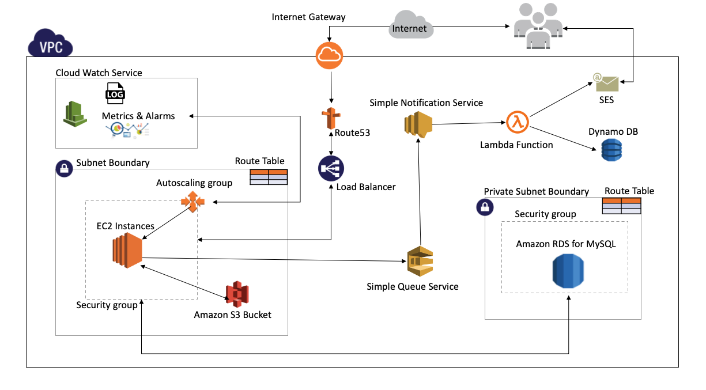
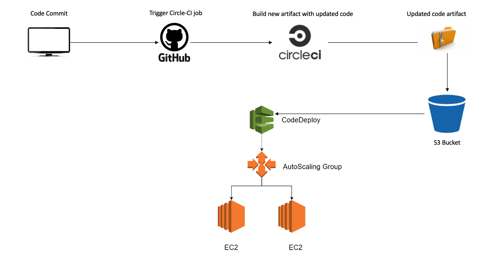

# Cloud-Computing

## Objective
 Deploying a web application on AWS-EC2

*Tools and Technologies*

  <table>
    <thead>
      <tr>
        <th>Category</th>
        <th>AWS Services & Technologies</th>
      </tr>
    </thead>
    <tbody>
        <tr>
            <td>Web Application</td>
            <td>Java, MySQL, Hibernate ORM,Shell Scripts, AWS-SDK</td>
        </tr>
        <tr>
            <td>Infrastructure</td>
            <td>VPC, ELB, RDS, Lambda, DynamoDB, Route53, Terraform</td>
        </tr>
         <tr>
            <td>Metrics & Logging Service</td>
            <td>statsD, AWS Cloud-Watch, Log4js, Cloud-Watch Alarm </td>
        </tr>
         <tr>
            <td>Lambda & Notification Mechanism</td>
            <td>Lambda,SNS, SES </td>
        </tr>
          <tr>
            <td>CI/CD Pipeline</td>
            <td>Circle CI, AWS Code Deploy, Packer</td>
        </tr>
       <tr>
            <td>Security</td>
            <td>SSL/TLS , RDS Encryption</td>
        </tr>
    </tbody>
  </table>
  

## Architecture Design

## Infrastructure - Terraform 

* created custom VPC with network setup using Terraform Script
* Attached Load balancers, auto scaling groups, SES and SNS services
* Created necessary service roles and policies for AWS resources
* Implemented Lambda function for emailing service 

## AMI - Hashicorp Packer ( CI/CD Pipeline )

* Automated AMI creation using Hashicorp packer
* Created AMI template to share the image between multiple AWS accounts
* Created golden images by adding provisioners to boostrap instances with - JDK, Code deploy and Cloud watch agent

## AWS Code Deployment (CI/CD Pipeline )

* Integrated Github repository with Circle-CI for continuous Integration
* Bootstrapped circle CI container with docker image to run the test cases and generate new code artifact
* Artifact is copied to S3 bucket and code deployement is triggered on running instances of autoscaling group
* In-Place deployment configuration hooks are placed for routing the traffic during deployment

## Logging & Alerting - Cloud Watch Services

* Embedded statD to collect various metrics such as counter for APIs hits and API response time etc
* Logged the info, errors and warnings using log4js and further mounted them in AWS cloud-watch for analysis
* Implemented CPU Utilization based alarms for changing number of instances in auto scaling group

## Faas (Serverless Computing) - Lambda 

* Implemented pub/sub mechanism with SNS and Lambda function
* when user requesting for password reset, message is published on SNS Topic
* Once message is published to SNS Topic, subscribed lambda function is trigged 
* Lambda delivers password reset link email to requesting user and saves the entry in Dynamo DB with TTL of 15 minutes

## Webapp -Online Book Store

API Impementation with `Spring Boot and Hibernate ORM`
Programming language : `Java`

External Libraries used:
1. UUID - for generating tokens
2. Bcrypt - for hashing out the passwords
3. basic-auth - Authentication module 
4. Hibernate - ORM for Java
5. mysql - dialect for hibernate
6. mockito - for integration testing in java

### Build & Deployment
* The application runs on AWS Cloud EC2 instance and is deployed via CircleCI pipe-line
* As soon as there is a merge take place to the webapp repository, the build gets triggered and deployment takes place in AWS account

### Load Testing
* Load testing is done by JMeter, download JMeter from offical website and run the jmx script
* Script is available in webapp folder  